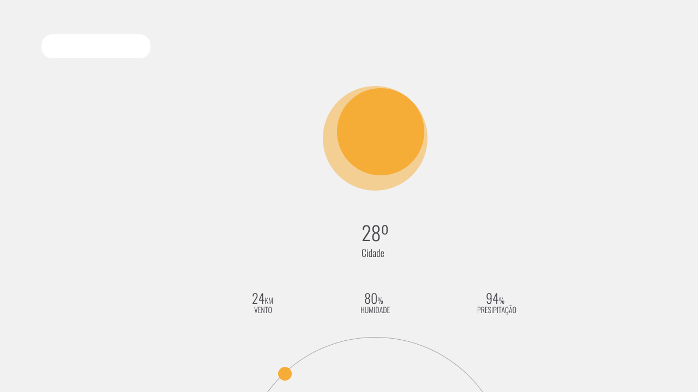
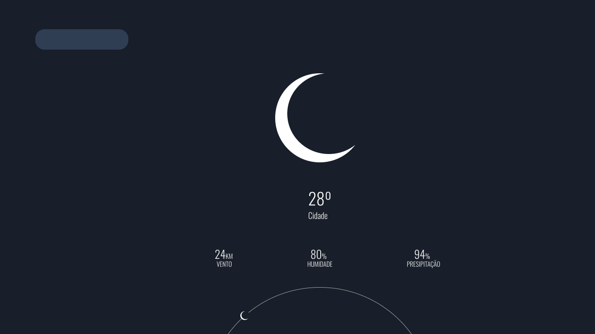

<h1 align="center">
    Weather
</h1>

<p align="center"> 
📖 Estudo dirigido a biblioteca React
</p>

<p align="center" style="margin-bottom:50px;">
 <a href="#🏁Sobre">Sobre</a> •
 <a href="#🧰Instalação">Instalacao</a> • 
 <a href="#✅tecnologias">Tecnologias</a> • 
 <a href="#📄como-usar">Como usar</a> •
 <a href="#features">Features</a> 
</p>

<p align="center">


</p>

<p align="center">

</p>


### 🏁Sobre

Weather apesar de simples e ser um caso de estudo não deixa de ser poderoso!

O aplicativo web conta com uma estrutura de Design system para a escala de design. 


### 🧰Instalação

#### 🚧 Alguns pré-requisitos 🚧
É necessário que você tenha o [node](https://nodejs.org/en/) instalado e o [npm](https://docs.npmjs.com/)

#### 🚀 Go 🚀
Utilize esse comando para clonar o repositório:
```GIT
git clone https://github.com/gleissonneves/02-create-project-weather-based-on-react/
```

Acesse ao diretório e digite os comandos para baixar as dependêcias:
```
Acessando o diretório:
cd 02-create-project-weather-based-on-react

# Donwload

npm install
```

### ✅Tecnologias

* [React](https://www.php.net/) version: 17.^ 
* [Node](https://www.php.net/) version: 14.^ 
* [NPM](https://www.npmjs.com/) version: 8.^ 

### 📄Como usar
 - Você pode buscar por uma cidade expecífica.
 - Com base na sua localização, podemos ver o clima
### Features

- [x] Busca por API dos dados de clima
- [x] Consulta de cidade
